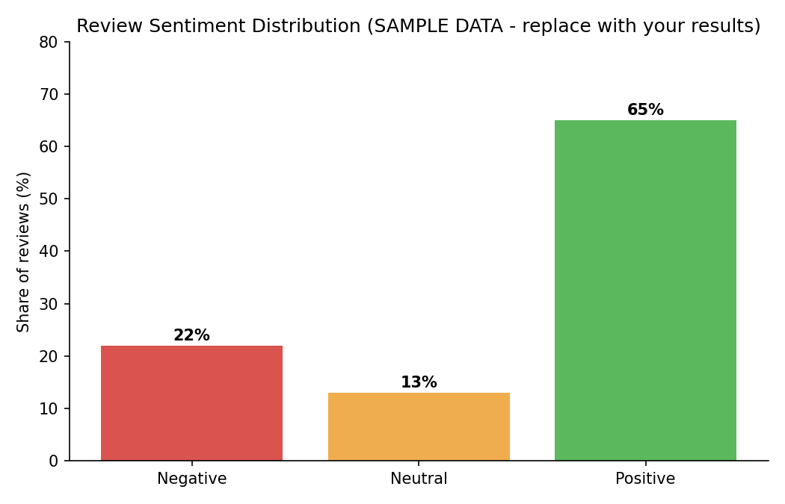

# customer-feedback-sentiment-analysis
# Customer Feedback Sentiment Analysis

## Problem
Analyze customer reviews to understand overall sentiment and find the most common complaints.

## Dataset
[Name and source of dataset, number of reviews]

## Tools
Python, pandas, VADER, Matplotlib

## Steps
1. Cleaned data (removed missing values and duplicates)
2. Classified reviews as Positive / Neutral / Negative using VADER
3. Extracted top complaint keywords from negative reviews
4. Visualized results

## Key Findings
- X% of reviews were positive, Y% negative
- Top complaint themes: [keyword 1], [keyword 2], [keyword 3]
- Recommendation: [what a support team should fix first]

## Chart

## How to Run
pip install pandas vaderSentiment matplotlib
python analysis.py
